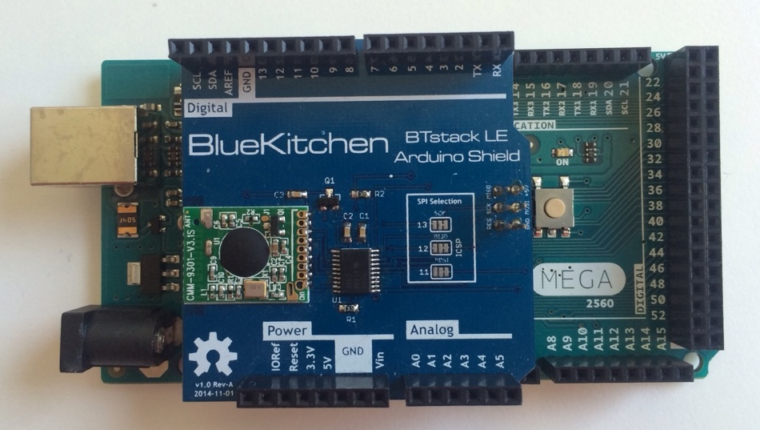
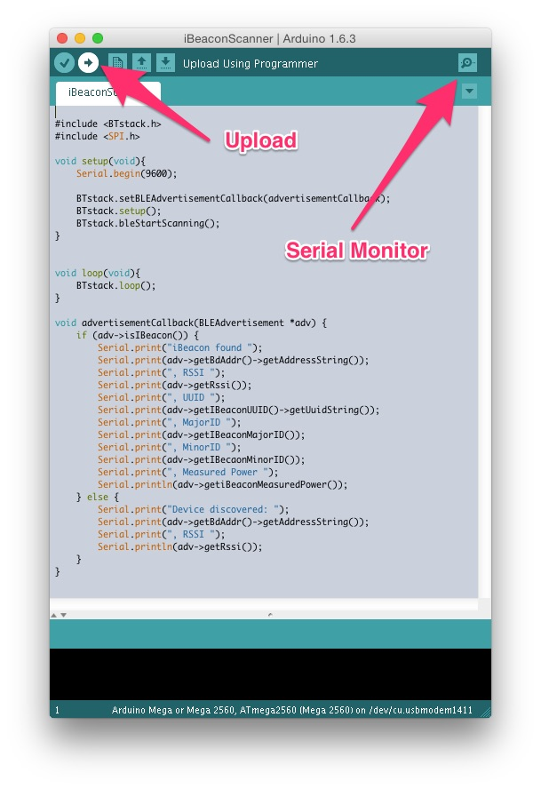

# Tutorial

## Arduino IDE

Please install the latest version of the Arduino IDE from <http://arduino.cc>.
This tutorial was created & tested with version 1.6.4, but it should work with all newer versions.

## BTstack Library

To install the BTstack library, please download it from <http://bluekitchen-gmbh.com/files/btstack-arduino-latest.zip>
and unpack it into your Arduino libraries folder. On OS X, that's:

    ~/Documents/Arduino/libraries

After installing the BTstack Library, you have to restart the Arduino IDE to make it show up in the examples section.

## Hardware
Please plug the BTstack LE Shield into one of the supported Arduino boards listed on the [Welcome page](../).
With an Arduino Mega 2560, it looks like this:

## Test

As a first test, open the iBeaconScanner example via File->Examples->BTstack->iBeaconScanner.
In the Sketch window, press the Upload button. 

After it was successfully uploaded to the board,
open the Serial Console.

The output should look similar to this:

    BTstackManager::setup()
    Local Address: 0C:F3:EE:00:00:00
    --> READY <--
    Start scanning
    Device discovered: 00:21:3C:AC:F7:38, RSSI -55
    Device discovered: 00:21:3C:AC:F7:38, RSSI -55
    Device discovered: D0:39:72:CD:83:45, RSSI -55
    Device discovered: D0:39:72:CD:83:45, RSSI -55
    Device discovered: D0:39:72:CD:83:45, RSSI -55
    Device discovered: D0:39:72:CD:83:45, RSSI -55

This example listens for BLE Advertisements and prints the Bluetooth BD_ADDR (similar to a WiFi MAC) address and the received signal strength. For iBeacons, also the Major ID, the Minor ID and the iBeacon UUID are shown.

Please have a look at the other [examples](../examples/generated/), too.

